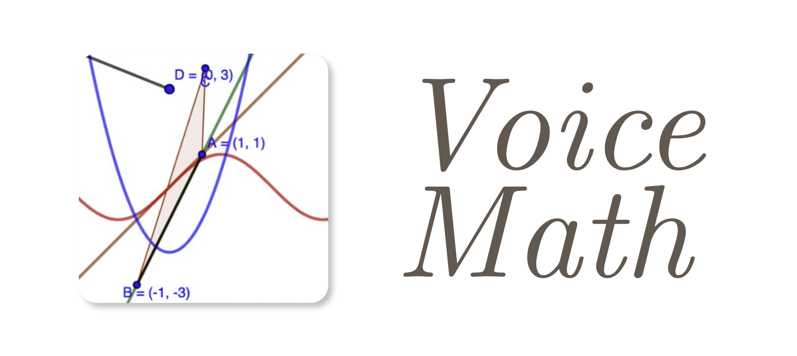

# VoiceMath

<p align="center">
  
</p>
<hr>

##### Korea Code Fair 2023 🥉

##### REGENERON ISEF 2024 Finalist

### Quick Start

```bash
# Github CLI
gh repo clone ysw421/VoiceMath
# or
git clone https://github.com/ysw421/VoiceMath.git

cd VoiceMath
pnpm install
pnpm build
./dist/VoiceMath-{version}.AppImage   # run electron
```

### Settings

setting file:

```
setting-var.ts
```
